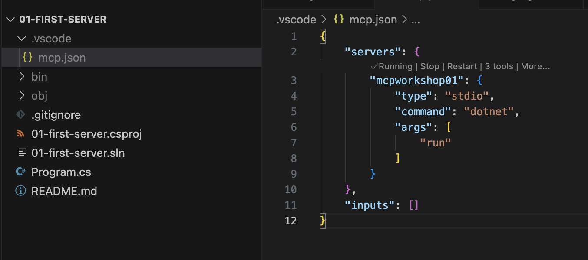

# 🧠 Model Context Protocol (MCP) Workshop for Beginners

Welcome to the MCP Workshop! This hands-on workshop will guide you through building and implementing Model Context Protocol servers and clients. Follow along with the presenter as we explore each milestone together.

## 🛠️ Prerequisites

Please install the following before the workshop:

### Essential Tools
- **VS Code** - [Download here](https://code.visualstudio.com/download)
  * Install the MCP extension from the marketplace
- **.NET 9 SDK** - [Download here](https://dotnet.microsoft.com/download/dotnet/9.0)
- **Docker Desktop** - [Download here](https://docs.docker.com/desktop/setup/install/windows-install/) (Required for .NET Aspire)
- **Azure CLI** - [Download here](https://learn.microsoft.com/cli/azure/install-azure-cli)
- **Azure Developer CLI (azd)** - [Download here](https://learn.microsoft.com/azure/developer/azure-developer-cli/install-azd)
- **Node.js & npm** - [Download here](https://nodejs.org/en/download)

### Optional but Recommended
- **Azure account** - [Free tier available](https://azure.microsoft.com/free/)
- **Basic knowledge of .NET/C#**

### Additional Setup for .NET Aspire
```bash
dotnet new install Aspire.ProjectTemplates
```

---

## 🎯 Workshop Milestones

### 🏃‍♂️ Milestone 1: First Server
Learn to create your first MCP server from scratch.

**Repository:** [mcp-workshop-01-first-server](https://github.com/nikosdelis/mcp-workshop-01-first-server.git)

---

### 💻 Milestone 2: First Client
Build a client that communicates with your MCP server.

**Repository:** [mcp-workshop-02-first-client](https://github.com/nikosdelis/mcp-workshop-02-first-client.git)

---

### 🤖 Milestone 3: GitHub Copilot Integration
Integrate your MCP server with GitHub Copilot for enhanced AI capabilities.



---

### 🌐 Milestone 4: HTTP Transport Mode
Implement MCP server using HTTP transport for web-based communication.

**Repository:** [mcp-workshop-04-shttp](https://github.com/nikosdelis/mcp-workshop-04-shttp.git)

---

### ☁️ Milestone 5: .NET Aspire Integration
Deploy and manage your MCP server using .NET Aspire with HTTP transport.

**Repository:** [mcp-workshop-05-aspire](https://github.com/nikosdelis/mcp-workshop-05-aspire.git)

---

## 📚 Additional Resources

- [Model Context Protocol Documentation](https://modelcontextprotocol.io/)
- [.NET Aspire Documentation](https://learn.microsoft.com/aspnet/core/fundamentals/aspire)
- [GitHub Copilot Documentation](https://docs.github.com/copilot)
- [Microsoft MCP for Beginners workshop material](https://github.com/microsoft/mcp-for-beginners)
